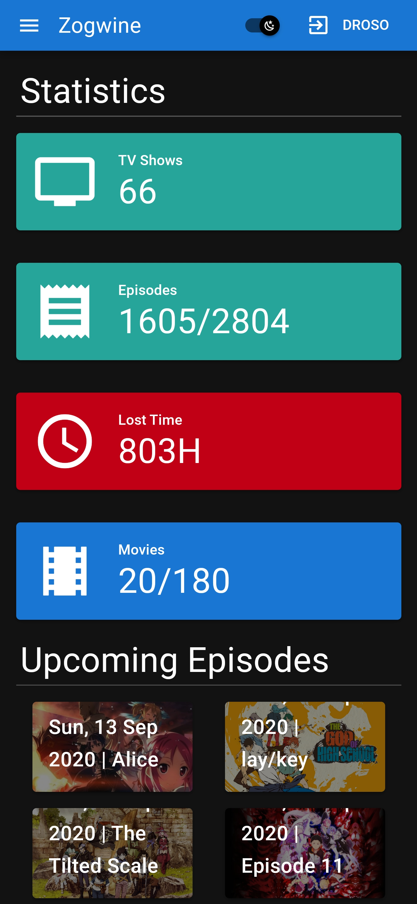
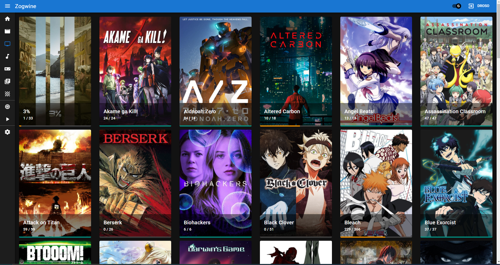
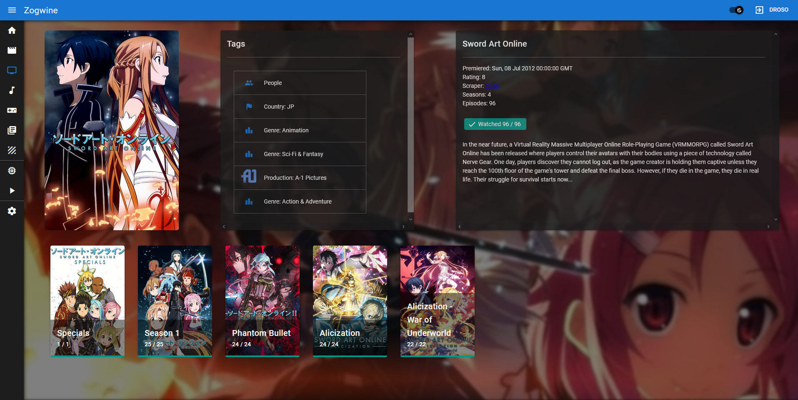
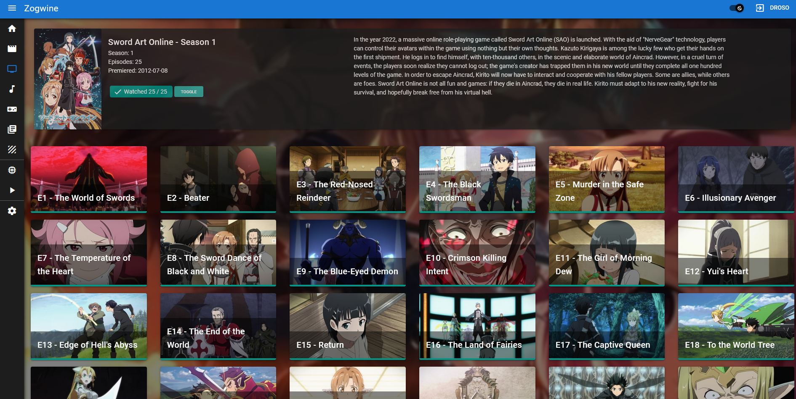
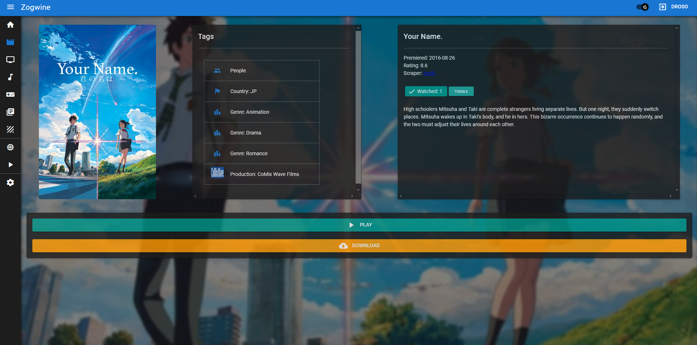
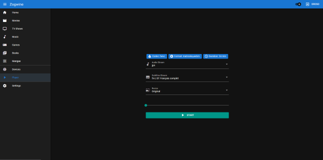

# Zogwine

Web UI to watch movies and tv shows (more upcoming) with integrated transcoder (based on ffmpeg).

:warning: Still under heavy development, not recommended for production use

[Web UI repo](https://github.com/drosoCode/Zogwine_UI)

## Installation
 - Import database.sql in your Database Server (Maria DB recommanded)
 - Clone and Build [WebUI](https://github.com/drosoCode/Zogwine_UI) and copy the content of dist folder in the static folder
 - Build Dockerfile with ``` docker build . -f Dockerfile_prod -t YOUR_IMAGE_NAME ```
 - Configure your database and scrapers api keys with the readme_res/cnofig_example.json template
 - Run your container with ``` docker run -d -v /YOUR_DATA_DIR:/home/server/content -v /YOUR_CONFIG_DIR/config:/home/server/config -v /YOUR_CONFIG_DIR/out:/home/server/out -p 8080:8080  --gpus=all YOUR_IMAGE_NAME ```

## Screenshots









